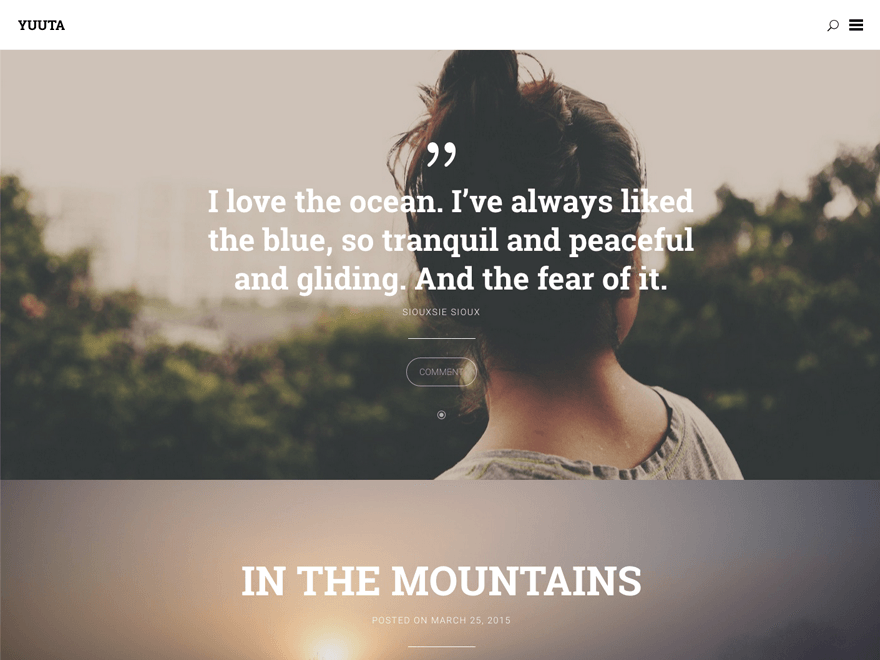

# Yuuta - A clean and free WordPress theme designed to serve as a visual diary

Yuuta is a clean and free WordPress theme designed to serve as a visual diary. Due to support of all post formats the theme is capable of displaying a pretty diversified blog.

[Live Demo](http://yuuta.felixdorner.de) / [Download Theme](https://wordpress.org/themes/yuuta)

## Support

As this is a free theme, support is limited to the basics. You can find me helping out in the designated [support forum](https://wordpress.org/support/theme/yuuta).

## Contributing

**Found a bug? Please report the issue [here](https://github.com/felixdorner/yuuta/issues)!** Want to contribute a patch or create a new feature? Just send me a pull request and I will review it.

Would you like to translate Yuuta in to your language? Get involved [here](https://translate.wordpress.org/projects/wp-themes/yuuta) and help to make this theme even more accessible.

## Author

**Felix Dorner**  
*Berlin-based designer and web developer*

- [Website](http://felixdorner.de)
- [Twitter](https://twitter.com/felixdorner)
- [Dribbble](https://www.dribbble.com/felixdorner)
